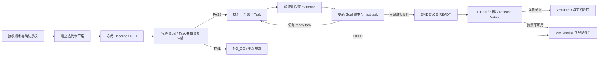
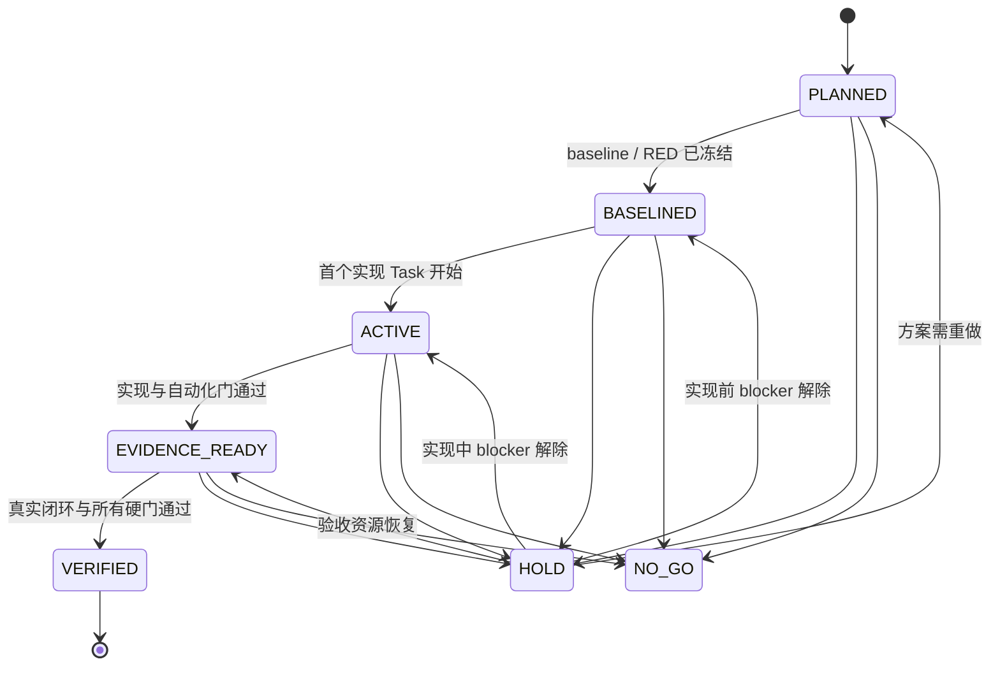

# Codex 通用 Goal 驱动迭代协议

> 状态：可复用 v1.0
> 适用范围：使用 Codex 进行代码、配置、迁移、文档或产品交付的项目
> 使用方式：将本文复制到项目文档目录，在 `AGENTS.md` 中声明为迭代事实源，并把文中的占位符替换为项目实际路径和命令

## 0. 这套协议解决什么问题

本协议把一次迭代组织成一条可恢复、可审查、可证明的工作链：

```text
用户结果 Goal
  -> 当前事实与失败基线
  -> 原子 Task
  -> 验证 Gate
  -> 可归因 Evidence
  -> Goal VERIFIED
```

它重点解决以下问题：

- Codex 在长任务、上下文压缩或新会话后，仍能从文档恢复到正确的下一步；
- “代码写完”“测试通过”和“用户结果已达成”不会被混为一谈；
- 计划、实现、真实环境验证、发布等不同授权边界不会被擅自扩大；
- 安全、隐私、兼容、数据和回退门禁不会被测试数量抵消；
- 每个结论都有可复查证据，每个遗留都有去向。

核心原则只有一句：**以 Goal 管结果，以 Task 管增量，以 Gate 管风险，以 Evidence 管事实。**

## 1. 规范用语

本文中的关键词按以下强度解释：

- **必须**：不满足时不得继续或不得宣称完成。
- **应该**：默认执行；跳过时必须记录原因。
- **可以**：按项目规模选择。
- **Goal**：用户、业务或系统可观察的结果，不是活动清单。
- **Task**：一次可独立验证的原子增量。
- **Gate**：进入下一阶段前必须满足的判定条件。
- **Evidence**：可复查的命令结果、测试报告、manifest、截图、转录或外部回执。
- **Oracle**：判断场景通过或失败的明确规则。
- **Baseline**：改动前的事实、失败复现、指标分母和已知异常。

## 2. 项目必须建立的事实源

一个项目至少维护四类文档。名称可以改变，职责不能混淆。

| 事实源        | 职责                                                    | 不应承载           |
| ------------- | ------------------------------------------------------- | ------------------ |
| `AGENTS.md`   | 项目命令、架构红线、授权边界、强制流程                  | 单次迭代的动态进度 |
| 迭代总表      | 当前 WIP、迭代索引、优先级、跨迭代依赖                  | 详细实现日志       |
| 迭代卡        | 单次迭代的 Goal、Task、Gate、Evidence、账本和 next task | 全项目长期路线图   |
| Evidence 目录 | 测试报告、截图、转录、基线、回退演练和机器可读结果      | 无法复现的口头结论 |

按项目需要再增加：

- 契约冻结清单：公共 API、schema、事件、CLI、持久化格式和兼容边界；
- Changelog：用户可见变更和版本事实；
- Backlog：不阻断当前 Goal 的欠账、风险和后续迭代候选；
- Runbook：部署、迁移、恢复、回退和事故处理步骤。

文档优先级建议固定为：

```text
AGENTS.md 的项目级硬约束
  > 已冻结的公共契约与安全不变量
  > 当前迭代卡的 Goal / Gate / 授权边界
  > Task 说明与临时执行记录
  > 聊天中的非持久共识
```

聊天中产生的新决策如果会影响后续执行，必须在本轮结束前写回事实源。

Codex 内置的临时 plan/checklist 可以镜像当前 Task，用来向用户展示执行进度，但它不是跨会话事实源，不能替代迭代卡和 Goal 账本。

## 3. 授权边界

Codex 必须先判断用户请求属于哪一种授权：

| 请求类型           | 默认允许                       | 默认不允许                                   |
| ------------------ | ------------------------------ | -------------------------------------------- |
| 计划 / 评审 / 分析 | 只读检查、写计划或评审文档     | 改生产代码、重启服务、改真实数据、打包、发布 |
| 实现 / 修复 / 构建 | 改范围内文件、运行相关验证     | 未要求的发布、外部通知、正式数据迁移         |
| 验证 / Dogfood     | 使用约定的隔离环境执行场景     | 对正式环境产生不可逆副作用                   |
| 发布 / 迁移 / 清理 | 仅执行用户明确授权的对象和范围 | 从“实现完成”推断已授权发布或删除             |

计划审查 `PASS` 只表示方案可执行，不等于授权执行。实现完成也不等于授权重启正式服务、切版本、打包、发布、发送消息或修改真实数据。

迭代卡顶部必须记录当前授权边界。边界变化时先更新卡片，再执行新增动作。

## 4. 变更分级与流程重量

| 类型     | 判定参考                                               | 最低要求                                                      |
| -------- | ------------------------------------------------------ | ------------------------------------------------------------- |
| 小改     | 单模块、低风险、不改变公共契约或数据语义               | 结果 Goal、受影响测试、GR-1/3/6/9、验收记录                   |
| 中改     | 跨模块、改变内部接口或关键用户流程                     | 完整迭代卡、GR-1..10、分层验证、回退说明                      |
| 大改     | 公共契约、schema、迁移、权限、并发、架构重构、发布链路 | 方案先行、完整审查、契约/失败基线、L-Real、回退演练、全量回归 |
| 安全修复 | 鉴权、隐私、路径、命令、密钥、数据删除等安全面         | 攻击场景复现、negative tests、fail-closed、修后攻击面复查     |

无法判断时按更高一级执行。全项目同时最多推进一个大改；其他工作只保留不干扰它的小改，避免多个事实面同时漂移。

## 5. 迭代生命周期



### 5.1 接收请求

Codex 必须先读取 `AGENTS.md`、相关事实源、当前 git 状态和相邻实现，随后写清：

- 用户想改变的可观察结果；
- 明确不做的内容；
- 影响的模块、契约、数据和外部系统；
- 当前授权允许做到哪一阶段；
- “完成”的最低判定标准。

### 5.2 建立迭代卡草案

中改和大改先创建迭代卡，写入初步 Goal、范围、授权边界、已知风险和 baseline 计划。小改也必须先明确结果 Goal、范围、验证和授权边界，可以使用简化卡。

此时 Goal 通常仍为 `PLANNED`，审查结论为 `PENDING`；不要在事实尚未核验时把假设写成 baseline。

### 5.3 Baseline first

在改动前运行与范围相称的构建、测试或真实场景，并记录原始通过/失败集合。若问题来自审计或报告，必须先读码核验并建立最小失败复现；无法稳定复现时，先建立 characterization evidence。

基线失败不自动成为本次回归。改动后的判定看相对于精确 baseline 的 delta。

### 5.4 完善计划并审查

用 baseline 完善 Goal、Task、Gate、Evidence 和回退方案。中改和大改必须通过完整 Goal 审查，再改生产代码；小改必须通过精简审查。

### 5.5 原子执行

每次只完成一个 ready Task。Task 应预计不超过半个工作日；风险高、跨模块或难以独立验收时继续拆分。

每个 Task 都执行：

```text
确认依赖和工作树
  -> 建立 RED / characterization
  -> 最小实现
  -> targeted GREEN
  -> 受影响回归
  -> 保存 Evidence
  -> 更新 Goal 账本和唯一 next task
```

### 5.6 验收与收口

自动化门通过后，Goal 通常只到 `EVIDENCE_READY`。只有真实环境、回退、兼容、安全和其他 closure gates 全部满足后，才允许进入 `VERIFIED`。

最终必须同步迭代总表、契约、Changelog、用户文档和 Backlog；没有归属的 TODO 不算收口。

## 6. Goal 模型与状态机

### 6.1 Goal 的写法

主结果 Goal 使用 `G0`，其余用 `G1..Gn`。Goal 必须描述状态变化，例如：

- 合格：升级失败后，用户仍可继续使用旧数据，且系统不会开放未经验证的新 writer。
- 不合格：完成升级服务开发并补测试。

每个 Goal 必须包含：

- Baseline / 当前差距；
- Closure rule；
- Owner；
- 依赖；
- Evidence 位置；
- Next ready task；
- Blocker 及解除条件。

指标型 Goal 还必须固定 numerator、denominator、去重键、数据源和排除口径。`unknown` 不能写成 `0`，Mock 数据不能混入真实指标。

### 6.2 状态机



| 状态             | 含义                                          |
| ---------------- | --------------------------------------------- |
| `PLANNED`        | Goal、范围和任务已定义，baseline 尚未冻结     |
| `BASELINED`      | 当前事实、失败复现和判定口径已冻结            |
| `ACTIVE`         | 正在产生实现增量                              |
| `EVIDENCE_READY` | 实现和自动化验证完成，只缺真实或发布级证据    |
| `VERIFIED`       | Closure rule 与所有硬门均由证据证明           |
| `HOLD`           | 依赖、授权或资源阻塞；必须写 owner 和解除条件 |
| `NO_GO`          | 安全不变量或主结果不可达，必须停止或重新规划  |

Task 完成、代码合入、构建通过、单平台通过或 Mock 通过，都不能单独把 Goal 标成 `VERIFIED`。

## 7. Goal Review Gates

中改和大改必须逐项审查 `GR-1..GR-10`；小改至少审查 `GR-1/3/6/9`。每项只能写 `PASS / HOLD / FAIL`，并附依据。

| Gate            | 审查问题                                | PASS 条件                                           |
| --------------- | --------------------------------------- | --------------------------------------------------- |
| GR-1 结果性     | Goal 是结果还是活动                     | 描述可观察状态变化，不以开发或测试动作替代结果      |
| GR-2 可判定     | Baseline、目标、口径、unknown 是否明确  | 指标口径固定；定性 Goal 有场景和 oracle             |
| GR-3 可追踪     | Goal、Task、Gate、Evidence 是否双向闭环 | 无孤立 Goal、无无主 Task、证据位置明确              |
| GR-4 可推进     | 原子增量和下一步是否明确                | 非终态 Goal 有 ready task、owner 和真实依赖         |
| GR-5 依赖真实   | 关键路径是否符合实现事实                | 无人为串行；硬阻塞与可并行项分开                    |
| GR-6 安全不变量 | 安全、隐私、兼容、保留是否 fail-closed  | 有 negative tests 和不可被平均抵消的 No-Go 门       |
| GR-7 证据充分   | 分层验证能否证明 Goal                   | 每层写资源、场景、oracle、证据路径；Mock 不冒充真实 |
| GR-8 回退可执行 | 回退是否保护数据与旧 reader             | 有顺序、触发条件、不可逆点和回退后验证              |
| GR-9 状态诚实   | Task 与 Goal 完成是否分离               | 存在 PENDING/HOLD/FAIL 时迭代不标完成               |
| GR-10 治理一致  | 契约、Changelog、总表、遗留是否同步     | owner、时点、Backlog 去向明确                       |

任何安全门 `FAIL` 都直接进入 `NO_GO`，不能用其他门的通过数量抵消。审查 `PASS` 后若 scope、依赖、冻结面、迁移策略或授权边界变化，必须重新审查受影响项。

审查发现按严重度记录，不能只写“已审查”：

| 级别 | 含义                                      | 处理                 |
| ---- | ----------------------------------------- | -------------------- |
| P0   | 数据泄漏、破坏性操作或目标自相矛盾        | 立即 `NO_GO`         |
| P1   | Goal 无法证明、关键场景漏验或依赖不可推进 | 修复前 `HOLD`        |
| P2   | 增加实现或验收风险，但不阻断整体开工      | 在对应 Task 前处理   |
| P3   | 表达、索引或维护性问题                    | 文档收口前处理或回流 |

## 8. Task 设计与执行循环

### 8.1 原子 Task 格式

| 字段              | 必填内容                                |
| ----------------- | --------------------------------------- |
| ID                | 稳定编号，例如 `F12-03b` 或 `ITER-07`   |
| Goal / Goal Delta | 推进哪个 Goal；结束后出现什么可观察变化 |
| Input             | 已满足的依赖、基线、决策和文件范围      |
| Output            | 代码、测试、文档或数据产物              |
| Verify            | 命令、场景、oracle 和预期结果           |
| Evidence          | 预定路径，完成后回填实际结果            |
| Depends on        | 真实依赖，不按文档顺序虚构串行关系      |
| Owner / Status    | 责任人和当前状态                        |

只产出 baseline 的 Task，其 Goal Delta 应写“推进到 `BASELINED`”，不能写成能力已完成。

### 8.2 风险优先

选择 next task 时按以下顺序判断：

1. 会推翻架构或安全前提的未知项；
2. 跨系统、真实资源、迁移和回退风险；
3. 公共契约、并发和数据一致性；
4. 主路径实现；
5. UI、文档和非阻断优化。

不要按任务编号机械推进。若新发现改变关键路径，先更新依赖、Gate 和账本，再继续实现。

### 8.3 新问题处理

- 阻断当前 Goal：暂停当前 Task，修订迭代卡并复审相关 GR。
- 不阻断当前 Goal：登记到 Backlog，写清严重度、owner 和不阻断理由。
- 来自用户或其他 agent 的并行改动：保留并理解，不擅自还原；影响当前 Task 时重新核对 baseline 和 diff。

## 9. 验证阶梯

每个项目应在 `AGENTS.md` 中把下表替换为真实命令。迭代卡只引用并补充本轮场景。

| 层              | 目的                                          | 典型内容                                      |
| --------------- | --------------------------------------------- | --------------------------------------------- |
| L0 静态 / Build | 证明可编译、格式与静态约束成立                | build、type-check、lint、format、schema 校验  |
| L1 Unit         | 证明局部规则和边界                            | 正例、反例、错误路径、属性测试                |
| L2 Integration  | 证明模块组合和进程内契约                      | 数据库、队列、HTTP、事件、重启模拟            |
| L3 Contract     | 证明公共面和兼容性                            | API/schema/golden/cross-version/old-reader    |
| L-Real          | 证明真实 binary、环境、账号或模型下的用户结果 | 真服务、真客户端、真实 provider、真实文件系统 |
| L-Rollback      | 证明失败后能恢复且不丢数据                    | 故障注入、回退、重启、re-apply                |
| L-Full          | 证明没有扩大回归                              | 受影响产品和下游全量测试                      |

验证范围随风险增加，不能机械要求所有小改跑所有层。但以下情况必须包含 L-Real 或等价真实证据：外部服务、模型行为、桌面壳、浏览器交互、平台文件系统、更新/迁移、凭证、通知投递。

涉及 UI 时，除自动测试外还必须验证目标 viewport、键盘/焦点、加载/空/错误状态、溢出和控制台错误；截图只证明画面，不自动证明交互与状态语义。

## 10. Evidence 规则

一份合格 Evidence 至少记录：

- Task / Goal ID；
- commit 或工作树版本；
- 时间、平台、架构和运行环境；
- 实际命令或操作步骤；
- 预期 oracle；
- 实际通过/失败/跳过数量；
- 产物路径或外部回执；
- 与 baseline 的 delta；
- 对真实服务、数据、消息、配置和账号产生的副作用。

证据强度必须诚实标注：

```text
Mock / Stub < Deterministic integration < Isolated real filesystem/process
            < Real provider/service < Actual user-facing packaged path
```

低层证据可以快速定位问题，但不能冒充高层闭环。真实测试若使用隔离 workspace，必须证明正式 workspace、正式服务和外部收件人不在测试 authority graph 内；“没有观察到副作用”不等于证明没有副作用。

测试波动需要与已知 baseline 对照。仅在失败可稳定复现、失败信息指向当前改动或失败集合相对 baseline 增加时，才判定为回归。

## 11. Release Gates、HOLD 与 NO_GO

迭代卡必须预先定义硬门，例如：

| Gate                | PASS 条件                                    | Evidence                          |
| ------------------- | -------------------------------------------- | --------------------------------- |
| RG-1 Baseline       | 现状与 RED 可复现，分母冻结                  | baseline report                   |
| RG-2 Implementation | 原子 Task 全部 GREEN，无未处理 P0/P1         | test reports + diff               |
| RG-3 Compatibility  | 新旧 reader/writer/API 行为符合冻结契约      | contract / cross-version report   |
| RG-4 Security       | negative、越权、泄漏和 fail-closed 场景通过  | security report                   |
| RG-5 L-Real         | 真实主场景和失败场景符合 oracle              | transcript / screenshot / receipt |
| RG-6 Rollback       | 回退与 re-apply 可执行且数据不丢失           | rollback report                   |
| RG-7 Regression     | 受影响域和下游回归相对 baseline 无新增失败   | full test report                  |
| RG-8 Governance     | 契约、Changelog、总表、文档和 Backlog 已同步 | document diff                     |

`HOLD` 必须写：reason code、blocker、owner、自动或人工重检触发、解除条件、可继续的其他 Goal。资源不可用是 HOLD，不是失败，也不是完成。

`NO_GO` 适用于安全不变量无法满足、目标自相矛盾、数据风险不可接受或关键依赖确定不可达。进入 `NO_GO` 后停止扩大实现，优先回退、保护数据或重新规划。

## 12. 跨会话续作协议

任何 Codex 新会话恢复迭代时，必须按顺序读取：

1. 项目 `AGENTS.md`；
2. 迭代总表中的当前状态和 WIP；
3. 当前迭代卡的授权边界、Goal 账本、审查记录和 Release Gates；
4. `Next ready task` 对应的 Task 定义与依赖；
5. 已有 Evidence；
6. `git status`、相关 diff 和最近变更。

恢复后先回答五个问题，再动手：

```text
当前主 Goal 是什么？
当前状态为什么不是 VERIFIED？
最高风险的 ready task 是什么？
它的依赖和授权是否满足？
完成它后要更新哪些 Evidence、差距和 next task？
```

如果账本写有 ready task 但依赖未满足，应修正为 `HOLD`；如果没有 ready task，Goal 又不是 `HOLD / NO_GO / VERIFIED`，说明账本不自洽，必须先修文档。

每个 Task 结束后立即更新：

- Task 状态与实际 Evidence；
- Goal 状态；
- Baseline / 当前差距；
- Closure rule 尚缺的门；
- 唯一或明确排序的 `Next ready task`；
- Blocker / Owner；
- 迭代总表中的摘要状态。

不要等到迭代末尾批量补账。跨会话可续作依赖的是当前事实，不是对聊天历史的猜测。

每个非终态 Goal 最多登记一个 `Next ready task`；迭代卡还必须从所有 Goal 中标出一个当前最高风险 task，作为下一会话的唯一默认入口。

## 13. Git 与并行协作纪律

- 开工前读取 `git status`，区分已有用户改动与当前任务范围。
- 不还原、不覆盖、不顺手格式化无关改动。
- 一个 diff 只解决一个问题；发现旁支问题进入 Backlog。
- 提交前检查实际 diff、冲突标记、调试代码、无主 TODO 和生成物。
- 多 agent 并行时按文件或职责分区；共享事实源由一个 owner 汇总，避免同时改账本。
- Task 完成不强制等于 commit；是否提交、推送、建 PR 或发布由用户授权和项目规则决定。

## 14. 完成定义

只有同时满足以下条件，迭代才可以标记完成：

- G0 和所有硬结果 Goal 均为 `VERIFIED`；
- GR 与 Release Gates 全部 `PASS`，`PENDING/HOLD/FAIL` 为 0；
- 基线、targeted、受影响回归和要求的 L-Real/rollback 均有 Evidence；
- 公共契约、兼容、安全和数据不变量已复核；
- 迭代总表、契约、Changelog、用户文档和 Backlog 已同步；
- 每个遗留都有 owner、编号和不阻断当前 Goal 的理由；
- `Next ready task` 为“无”，且不存在未登记的执行项；
- 最终说明明确列出未执行或未获授权的动作，例如未发布、未迁移正式数据。

## 15. 可复制的迭代卡模板

```markdown
# 迭代卡 <ID> - <标题>

> 状态：规划中 | 进行中 | 验收中 | HOLD | 完成 | NO_GO
> 变更分类：小改 | 中改 | 大改 | 安全修复
> 方案出处：<需求 / issue / audit / backlog>
> 日期：<开始> / <完成>
> Goal 审查：PENDING | PASS | HOLD | FAIL
> 当前授权边界：<允许与禁止的动作>
> 复审触发：<scope / 契约 / 数据 / 依赖 / 授权变化>

## 1. 目标与范围

- 做什么：
- 不做什么：
- 影响面：
- 完成定义：

### 1.1 Goal 定义

| Goal | 用户/系统结果 | Baseline / 当前差距 | Closure rule | Owner |
| ---- | ------------- | ------------------- | ------------ | ----- |
| G0   |               |                     |              |       |

### 1.2 Goal -> Task -> Gate -> Evidence

| Goal | Tasks     | Closure Gates | Evidence |
| ---- | --------- | ------------- | -------- |
| G0   | T-01..T-n | RG-1..RG-n    | <path>   |

### 1.3 Goal 审查

| Review  | 日期       | 结论    | 阻断发现 | 处理结果 |
| ------- | ---------- | ------- | -------- | -------- |
| Initial | YYYY-MM-DD | PENDING |          |          |

| Gate | GR-1    | GR-2    | GR-3    | GR-4    | GR-5    | GR-6    | GR-7    | GR-8    | GR-9    | GR-10   |
| ---- | ------- | ------- | ------- | ------- | ------- | ------- | ------- | ------- | ------- | ------- |
| 结果 | PENDING | PENDING | PENDING | PENDING | PENDING | PENDING | PENDING | PENDING | PENDING | PENDING |

### 1.4 Goal 进度账本

| Goal | 状态    | Baseline / 当前差距 | Closure rule | Evidence | Next ready task | Blocker / Owner |
| ---- | ------- | ------------------- | ------------ | -------- | --------------- | --------------- |
| G0   | PLANNED |                     |              | PENDING  | T-01            | 无 / <Owner>    |

## 2. 任务与依赖

| Task | Goal / Goal Delta     | Input | Output | Verify / Evidence | Depends on | Owner / 状态 |
| ---- | --------------------- | ----- | ------ | ----------------- | ---------- | ------------ |
| T-01 | G0 / 推进到 BASELINED |       |        |                   | 无         |              |

## 3. 测试与验收计划

| 层         | 场景与 Oracle | 命令 / 资源 | Evidence |
| ---------- | ------------- | ----------- | -------- |
| L0         |               |             |          |
| L1         |               |             |          |
| L2         |               |             |          |
| L3         |               |             |          |
| L-Real     |               |             |          |
| L-Rollback |               |             |          |
| L-Full     |               |             |          |

## 4. Release Gates 与停止条件

| Gate | PASS 条件 | Evidence | 状态    |
| ---- | --------- | -------- | ------- |
| RG-1 |           |          | PENDING |

| 触发条件 | 结论         | 动作 / 解除条件 | Owner |
| -------- | ------------ | --------------- | ----- |
|          | HOLD / NO_GO |                 |       |

## 5. 回退计划

- 触发条件：
- 回退顺序：
- 数据与旧 reader 保护：
- 不可逆点：
- 回退后验证：
- Re-apply 条件：

## 6. 验收记录

- Baseline：
- 实现与 targeted：
- 回归：
- L-Real：
- 回退：
- 副作用：
- Goal 完成复审：

## 7. 文档同步

- [ ] 迭代总表
- [ ] 契约冻结清单（如适用）
- [ ] Changelog（如适用）
- [ ] 用户 / 运维文档（如适用）
- [ ] Goal 账本、Evidence 和 next task

## 8. 遗留与回流

| ID  | 遗留 | 严重度 | 不阻断理由 | Owner / Backlog |
| --- | ---- | ------ | ---------- | --------------- |
```

## 16. 可复制的 `AGENTS.md` 最小约束

将以下片段按项目实际路径和命令修改后放入 `AGENTS.md`：

```markdown
## Iteration Workflow

- Iterations follow `<path>/CODEX_GENERAL_ITERATION_PROTOCOL.md`.
- Before changing code, run and record the relevant baseline.
- Every medium/large change must have an iteration card before production code changes.
- Small changes must at least define a result Goal, scope, authorization boundary, verification, and GR-1/3/6/9.
- Medium/large plans must pass GR-1..GR-10 before implementation.
- A plan/review request does not authorize implementation, service restart, release, external messages, or real-data mutation.
- Resume work from the Goal ledger's highest-risk ready task after checking dependencies, authorization, evidence, and git status.
- After every Task, update its evidence, Goal status, remaining gap, blocker, and next ready task.
- Task completion, code completion, Mock success, or automated tests alone never make a Goal VERIFIED.
- Do not mark an iteration complete until all hard Goals are VERIFIED, all release gates pass, documentation is synchronized, and leftovers have owners and backlog IDs.
- Preserve unrelated user changes; never revert or overwrite them to make the task easier.

## Build And Test

- L0: `<build / type-check / lint commands>`
- L1: `<unit test commands>`
- L2/L3: `<integration / contract commands>`
- L-Real: `<real environment runbook>`
- L-Full: `<full regression and downstream commands>`
```

## 17. 新项目落地清单

首次采用本协议时完成以下动作：

- [ ] 把本文放入项目文档目录并在 `AGENTS.md` 建立入口；
- [ ] 填写项目真实的 L0/L1/L2/L3/L-Real/L-Full 命令；
- [ ] 建立迭代总表、卡片目录和 Evidence 目录；
- [ ] 识别公共契约、数据、权限、发布和外部副作用边界；
- [ ] 约定小改/中改/大改标准以及全局大改 WIP 限制；
- [ ] 创建第一张迭代卡，执行 baseline 和 GR 审查；
- [ ] 用一次完整迭代验证跨会话恢复、HOLD、回退和文档收口是否可执行；
- [ ] 根据项目实际经验修订命令和边界，不削弱 Goal、Gate、Evidence 和诚实状态四个核心约束。

采用完成的判定不是“文档已复制”，而是一个不了解聊天历史的新 Codex 会话，只读项目事实源就能准确说出：当前 Goal、当前差距、最高风险 ready task、所需授权、验收 oracle 和完成条件。
